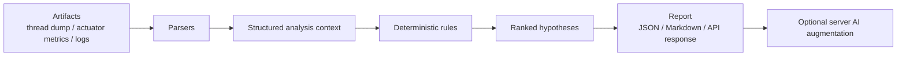

[English](README.md) | [简体中文](README.zh-CN.md)

# jvm-doctor

[](https://github.com/SCY121/jvm-doctor/actions/workflows/ci.yml)
[](https://openjdk.org/)
[](https://spring.io/projects/spring-boot)

An evidence-driven JVM incident triage toolkit for Spring Boot applications.

`jvm-doctor` turns fragmented runtime artifacts such as `thread dump`, `actuator metrics`, and `application logs` into a first-pass diagnosis with deterministic findings, ranked hypotheses, and next actions. On the server path, it can also add optional AI-generated narrative guidance through an OpenAI-compatible API.

## Why It Exists

During a real production incident, engineers often jump between:

- `thread dump`
- `Actuator`
- logs
- JFR
- deploy changes

Each tool is useful on its own, but the workflow is fragmented. `jvm-doctor` focuses on the first `5-10` minutes of incident triage:

- identify the likely failure class quickly
- preserve the evidence chain
- turn raw artifacts into a report that can be shared

## Current Status

Current version: `v0`

Available today:

- Parse `thread dump`, `actuator metrics`, and `application logs`
- Match `8` deterministic findings for common JVM and Spring incidents
- Generate reports through both `CLI` and `HTTP API`
- Pull snapshots from Spring Boot Actuator
- Add optional server-side AI augmentation through an OpenAI-compatible API
- Validate behavior with a reproducible incident corpus and benchmark runner

Not included yet:

- CLI AI support
- JFR ingestion
- heap dump analysis
- MCP integration

## Workflow



## Quick Start

### Requirements

- Java `21`
- Maven `3.9+`

Make sure `java -version` points to JDK 21 before running commands.

### Build And Test

```powershell
mvn -B test
```

### Run The CLI On A Sample Incident

```powershell
mvn -q -pl jvm-doctor-cli exec:java "-Dexec.args=--thread-dump samples/incidents/db-pool-exhausted/thread-dump.txt --actuator-metrics samples/incidents/db-pool-exhausted/actuator-metrics.json --log samples/incidents/db-pool-exhausted/app.log --format markdown"
```

### Start The HTTP Server

```powershell
mvn -q -pl jvm-doctor-server spring-boot:run
```

### Optional AI Augmentation For The Server

AI is disabled by default. To enable it, provide configuration through environment variables:

```powershell
$env:JVM_DOCTOR_AI_ENABLED="true"
$env:JVM_DOCTOR_AI_BASE_URL="<openai-compatible-base-url>"
$env:JVM_DOCTOR_AI_API_KEY="<api-key>"
$env:JVM_DOCTOR_AI_MODEL="<model-name>"
```

Available endpoints in `v0`:

- `GET /api/v1/about`
- `POST /api/v1/analyses`
- `GET /api/v1/analyses/{id}`
- `GET /api/v1/rules`
- `POST /api/v1/actuator/snapshot`

### Run The Incident Corpus Benchmark

```powershell
mvn -q -pl jvm-doctor-bench exec:java
```

## Example Output

```text
Findings
- [CRITICAL] The database connection pool is exhausted or nearly exhausted...
- [HIGH] HTTP worker threads are close to exhaustion...
- [HIGH] Thread stacks and logs both point to downstream I/O blocking...

AI
- Status: COMPLETED
- Summary: Database access is the leading bottleneck in this incident.
```

## Supported Findings In v0

- `HTTP_THREAD_POOL_EXHAUSTED`
- `DB_POOL_EXHAUSTED`
- `DEADLOCK_DETECTED`
- `LONG_BLOCKING_IO`
- `FULL_GC_STORM`
- `OOM_OR_LEAK_SUSPECTED`
- `CPU_HOT_BUT_NOT_GC`
- `LOGGING_OVERHEAD_SUSPECTED`

## Incident Corpus

Current sample cases:

- `minimal`
- `db-pool-exhausted`
- `deadlock-detected`
- `oom-pressure`

The benchmark validates each case against `expectations.json`, including:

- required findings
- forbidden findings
- maximum finding count

## Repository Layout

- `jvm-doctor-domain`: shared domain model
- `jvm-doctor-parser`: artifact parsers
- `jvm-doctor-rules`: deterministic rules
- `jvm-doctor-ai`: rule-based hypothesis generation for the deterministic engine
- `jvm-doctor-engine`: orchestration pipeline
- `jvm-doctor-cli`: command-line interface
- `jvm-doctor-server`: Spring Boot HTTP server and optional AI augmentation
- `jvm-doctor-bench`: sample corpus benchmark runner
- `samples/incidents`: reproducible incident cases
- `docs`: product, architecture, and public-facing design notes

## Documentation

- [Chinese README](README.zh-CN.md)
- [Product and architecture notes](docs/jvm-doctor-prd.md)
- [Server AI augmentation design](docs/server-ai-design.md)
- [Artifact input contract](docs/artifact-input-contract.md)

## Roadmap

Near-term priorities after `v0`:

1. JFR ingestion and evidence extraction
2. Larger public incident corpus
3. MCP server support
4. Provider-agnostic AI integration beyond the current OpenAI-compatible mode
