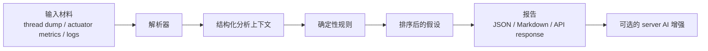

[English](README.md) | [简体中文](README.zh-CN.md)

# jvm-doctor

[](https://github.com/SCY121/jvm-doctor/actions/workflows/ci.yml)
[](https://openjdk.org/)
[](https://spring.io/projects/spring-boot)

一个面向 Spring Boot 应用、基于证据链的 JVM 故障初诊工具。

`jvm-doctor` 的目标不是替代 Arthas、JFR、VisualVM 或完整 APM 平台，而是把 `thread dump`、`actuator metrics`、`application logs` 这类分散运行时材料整理成第一轮可执行判断：确定性 findings、排序后的 hypotheses，以及下一步排查动作。在 server 路径上，它还可以通过 OpenAI-compatible API 追加可选的 AI 摘要与建议。

## 为什么做这个项目

真实线上故障里，工程师往往需要来回切换：

- `thread dump`
- `Actuator`
- 日志
- JFR
- 发布变更

这些工具单独都很有价值，但流程是碎的。`jvm-doctor` 聚焦在事故发生后的前 `5-10` 分钟：

- 快速判断更像哪一类问题
- 保留结论背后的证据链
- 把原始材料转成可以共享的报告

## 当前状态

当前版本：`v0`

当前已具备：

- 解析 `thread dump`、`actuator metrics`、`application logs`
- 命中 `8` 条常见 JVM / Spring 故障的确定性规则
- 通过 `CLI` 和 `HTTP API` 输出报告
- 从 Spring Boot Actuator 抓取快照
- 通过 OpenAI-compatible API 为 server 提供可选的 AI 增强摘要
- 用可复现的样本集和 benchmark 做行为验证

暂未包含：

- CLI 侧 AI 支持
- JFR 接入
- heap dump 分析
- MCP 集成

## 工作流



## 快速开始

### 环境要求

- Java `21`
- Maven `3.9+`

运行前请先确认 `java -version` 指向 JDK 21。

### 构建与测试

```powershell
mvn -B test
```

### 用 CLI 跑一个示例故障

```powershell
mvn -q -pl jvm-doctor-cli exec:java "-Dexec.args=--thread-dump samples/incidents/db-pool-exhausted/thread-dump.txt --actuator-metrics samples/incidents/db-pool-exhausted/actuator-metrics.json --log samples/incidents/db-pool-exhausted/app.log --format markdown"
```

### 启动 HTTP 服务

```powershell
mvn -q -pl jvm-doctor-server spring-boot:run
```

### 为 Server 启用可选 AI 增强

AI 默认关闭，需要通过环境变量显式开启：

```powershell
$env:JVM_DOCTOR_AI_ENABLED="true"
$env:JVM_DOCTOR_AI_BASE_URL="<openai-compatible-base-url>"
$env:JVM_DOCTOR_AI_API_KEY="<api-key>"
$env:JVM_DOCTOR_AI_MODEL="<model-name>"
```

`v0` 当前提供的接口：

- `GET /api/v1/about`
- `POST /api/v1/analyses`
- `GET /api/v1/analyses/{id}`
- `GET /api/v1/rules`
- `POST /api/v1/actuator/snapshot`

### 运行样本集 benchmark

```powershell
mvn -q -pl jvm-doctor-bench exec:java
```

## 示例输出

```text
Findings
- [CRITICAL] The database connection pool is exhausted or nearly exhausted...
- [HIGH] HTTP worker threads are close to exhaustion...
- [HIGH] Thread stacks and logs both point to downstream I/O blocking...

AI
- Status: COMPLETED
- Summary: Database access is the leading bottleneck in this incident.
```

## v0 已支持的 Findings

- `HTTP_THREAD_POOL_EXHAUSTED`
- `DB_POOL_EXHAUSTED`
- `DEADLOCK_DETECTED`
- `LONG_BLOCKING_IO`
- `FULL_GC_STORM`
- `OOM_OR_LEAK_SUSPECTED`
- `CPU_HOT_BUT_NOT_GC`
- `LOGGING_OVERHEAD_SUSPECTED`

## 样本集

当前样本包括：

- `minimal`
- `db-pool-exhausted`
- `deadlock-detected`
- `oom-pressure`

benchmark 会根据每个样本目录下的 `expectations.json` 校验：

- 必须命中的 findings
- 禁止命中的 findings
- 最大 findings 数量

## 仓库结构

- `jvm-doctor-domain`：共享领域模型
- `jvm-doctor-parser`：输入材料解析器
- `jvm-doctor-rules`：确定性规则层
- `jvm-doctor-ai`：供确定性引擎使用的规则型假设生成层
- `jvm-doctor-engine`：分析编排管线
- `jvm-doctor-cli`：命令行入口
- `jvm-doctor-server`：Spring Boot HTTP 服务与可选 AI 增强
- `jvm-doctor-bench`：样本集 benchmark 运行器
- `samples/incidents`：可复现的事故样本
- `docs`：产品、架构和公开设计文档

## 文档

- [English README](README.md)
- [产品与架构说明](docs/jvm-doctor-prd.md)
- [Server AI 增强设计](docs/server-ai-design.md)
- [输入协议](docs/artifact-input-contract.md)

## 路线图

`v0` 之后的近端优先级：

1. 接入 JFR，提取更多 evidence
2. 扩大公开 incident corpus
3. 支持 MCP Server
4. 在现有 OpenAI-compatible 模式之外，补齐更通用的 AI provider 抽象
